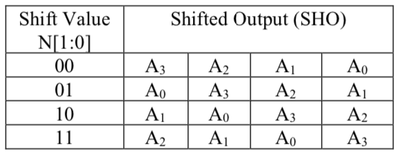
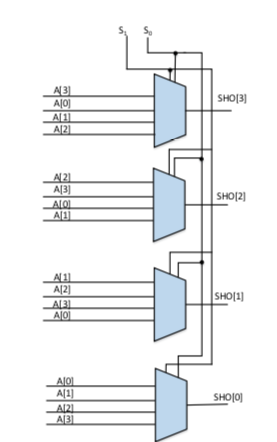

# Basic-RTL-Packages
Building a n-bit barrel shifter, with an n-bit data-input, A[n-1:0], and an i-bit shift-value, N[i- 1:0], where i is: i=log2n

1. A SystemVerilog description of a 4-to-1 MUX.

2. Using four 4-to-1 Multiplexers to build a 4-bit barrel shifter. 

3. Generating a 16-to-1 multiplexer, and using module instantiations for instantiating the necessary number of instances of the 4-to-1 multiplexer.

4. Building a 16-bit barrel shifter by using the 16-to-1 multiplexer. 

Table below shows the output table for a 4-bit barrel shifter:

Also, the block diagram of a 16-bit barrel shifter can be seen as below:

